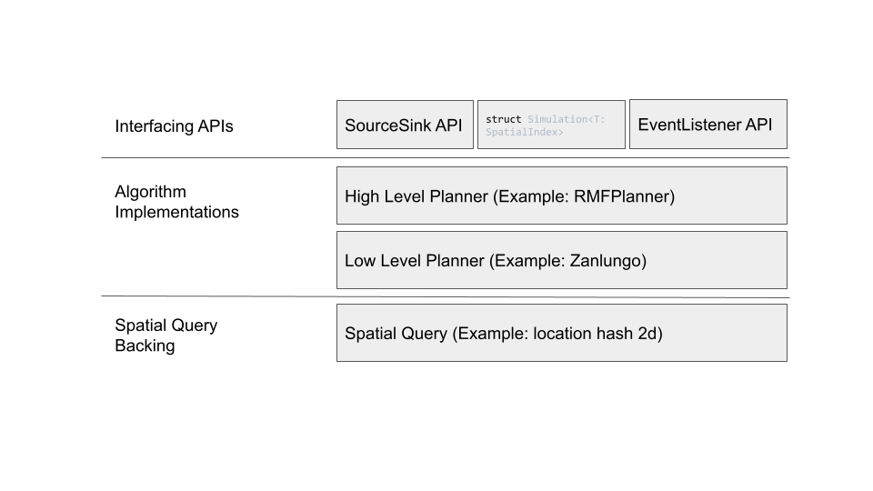
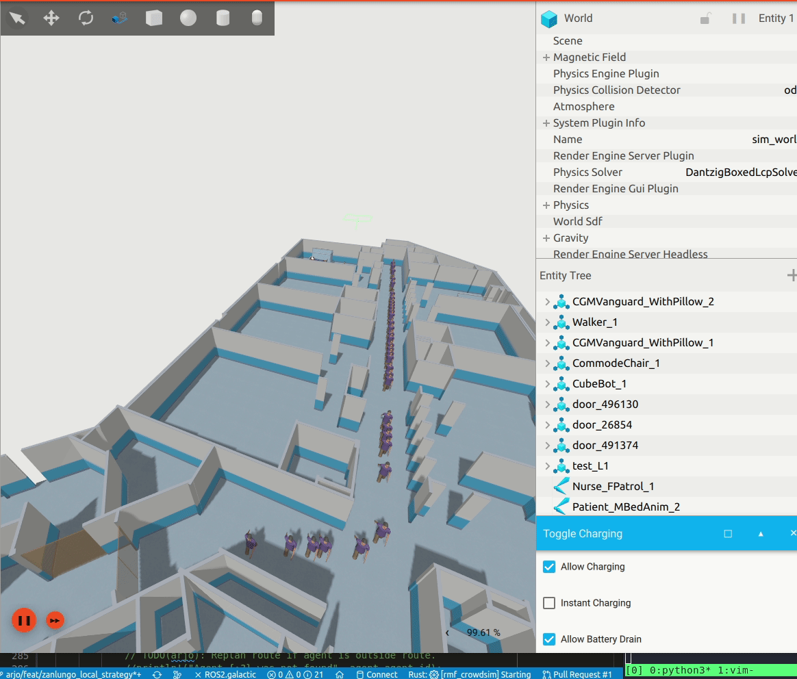
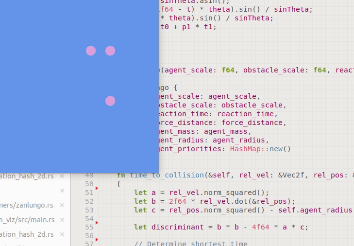

# Crowd simulation framework

> :warning: Under construction

The following is going to be a crowd simulation framework written in rust.

## Tentative Documentation

The RMF Crowdsim is an experimental crowd simulation API written in Rust.
The core principal of crowdsim is to provide an easy-to-use API as a drop-in
crowd simulation framework. Currently, it provides a very rudimentary API which
gives the end user maximum control over individual agents. There are several key classes to interact with the simulation.

The first class to be aware of is the [`Simulation`](rmf_crowdsim/src/lib.rs#68) struct. This struct holds the main simulation. In particular the [`agents`](rmf_crowdsim/src/lib.rs#70) property contains the whole simulation state at a given timepoint. `Simulation`s need a spatial query to provide fast nearest neighbour search to the local planner. Currently we ship with a simple
`LocationHash2D` object for fast spatial queries.

To spawn agents one may use the `Simulation::add_agents` method to add a fixed number of agents at a given time step. An example of such an application can be found in `rmf_crowdsim_viz`. Additionally, if you would like a stream of agents that are spawned and de-spawned, I recommend looking at the [`SourceSink`](rmf_crowdsim/src/source_sink/source_sink.rs) APIs. This allows you to create a stream of agents using the built-in crowd generators. For an example of how to use we encourage you to look at the test in `rmf_crowdsim/tests/event_listeners_test.rs`.

Additionally one may notice the use of High-level planners and low-level planners. High-level planners influence the overall route planning of the system - They do not take into account local interactions that individual agents may have. Currently, we ship with one High-level planner, `RMFPlanner`.
This planner takes in an RMF building description in YAML and uses the single-level floor plan for planning routes between rustlings. Low-level planners perform immediate collision avoidance with other agents. For instance,
low level planners allow us to avoid other agents given information in a local vicinity. Currently we ship with two low level planners. The first is `NoLocalPlan` which simply relays velocities as is to the manikins, the second is `Zanlungo` which is a incomplete local force based avoidance algorithm based on Zanlungo et al.'s work.

If you would like to script custom agent behaviours we recommend using the
High Level Planner API and implementing the `HighLevelPlanner` trait.

We also provide an `EventListener` API which is useful for listening for events agents undergo during simulation, for instance their creation or destruction.
This can be used for integrating crowdsim with other applications like Gazebo.

## Examples
The following are some example applications that utilize crowdsim for crowd simulation.

### Gazebo Integration

Here we provide C-bindings to rmf-crowdsim along with tight gazebo integration.

Here we show local avoidance. See `rmf_crowdsim_viz`.
## Caveats
To integrate with bevy you will need to use `ExclusiveSystems` as unfortunately Im using mutex where I probably should not be.